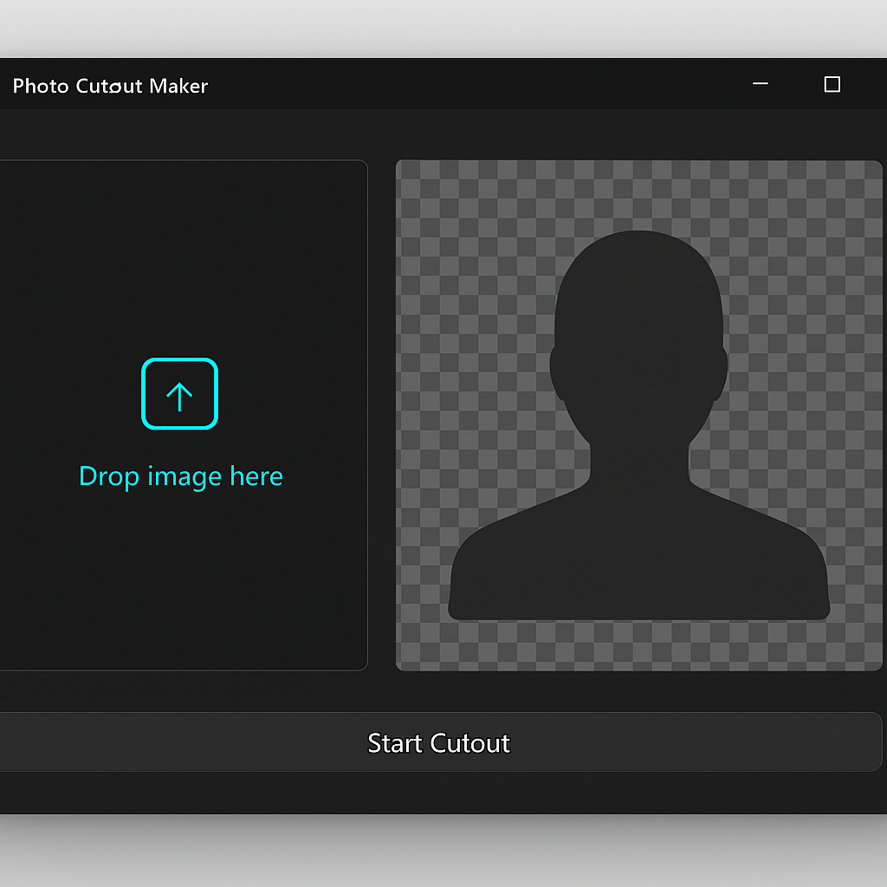

# Photo Cutout Maker

**A powerful photo cutout maker that effortlessly removes backgrounds to create transparent PNG images.**

Photo Cutout Maker is a free offline Windows utility designed to simplify the process of background removal from images. This photo cutout maker allows you to produce high-quality transparent PNG cutouts quickly, addressing the common challenge of unwanted backgrounds in photos. With its one-click AI processing, creating a clean image bg cutout has never been easier.

## Features
- 🎨 **Instant Background Removal** — Use our one-click bg removal feature to eliminate backgrounds in seconds.
- 🖥️ **Lightweight Utility** — The entire tool is under 15 MB, making it easy to download and install on any Windows system.
- 🔒 **Privacy-Focused** — No ads, no telemetry, and completely offline, ensuring your images remain private.
- 📄 **Open Source** — As an MIT-licensed project, the source code is available for those interested in customization or contribution.
- ⚡ **Fast AI Processing** — Leverage advanced AI algorithms for quick and accurate image bg cutout results.
- 🖼️ **Transparent PNG Creator** — Output images in PNG format with transparent backgrounds for seamless integration.
- 🔄 **User-Friendly Interface** — Navigate easily through a simple UI designed for efficiency and speed.
- 💻 **Windows Compatibility** — Fully functional on Windows 10 and Windows 11 (64-bit), ensuring broad accessibility.
- 🔧 **Hotkey Support** — Streamline your workflow with customizable hotkeys for frequent actions.
- 📦 **Easy Installation** — Ships as a signed MSI installer for straightforward setup without complications.
- 🚀 **No Bundles or Additional Software** — Focus on your task without worrying about unwanted installations or bloatware.
- 🔑 **Safe and Secure** — Regular updates and community support help maintain the integrity of the cutout tool windows.

## How to use
1. Download the latest version from the release section: `PhotoCutoutMaker.zip`.
2. Unzip the file and locate `PhotoCutoutMaker.msi`.
3. Run the installer to set up the application in your Program Files.
4. Launch Photo Cutout Maker from your start menu or desktop.
5. Import an image and use the one-click bg removal feature to create your cutout.
6. Save your cutout as a transparent PNG for easy use.

## Use cases
- **E-commerce Photographers**: Quickly create product images with clean backgrounds for online listings.
- **Graphic Designers**: Efficiently prepare images for presentations and marketing materials by removing backgrounds.
- **Social Media Managers**: Enhance posts by isolating subjects and creating eye-catching graphics.
- **Content Creators**: Streamline the editing process for thumbnails and promotional images with transparent PNG cutouts.
- **Students and Educators**: Facilitate the creation of educational materials that require clear and focused images.

## Download
- Latest release: [`PhotoCutoutMaker.zip`](https://github.com/jonasrun09/photo-cutout-maker/releases/latest/download/PhotoCutoutMaker.zip)
- Unzip and run `PhotoCutoutMaker.msi` — standard Windows install to Program Files.
- Each release page includes a SHA-256 hash so you can verify the file.

## Compatibility
Windows 10 (64-bit) and Windows 11 (64-bit). No .NET framework install required.

## Fair use / responsibility
Photo Cutout Maker is designed for personal and professional use. Users are responsible for ensuring that images utilized comply with copyright laws and do not infringe on any rights. Use the tool responsibly and respect the privacy and ownership of images.

## License
MIT — free for personal and commercial use.